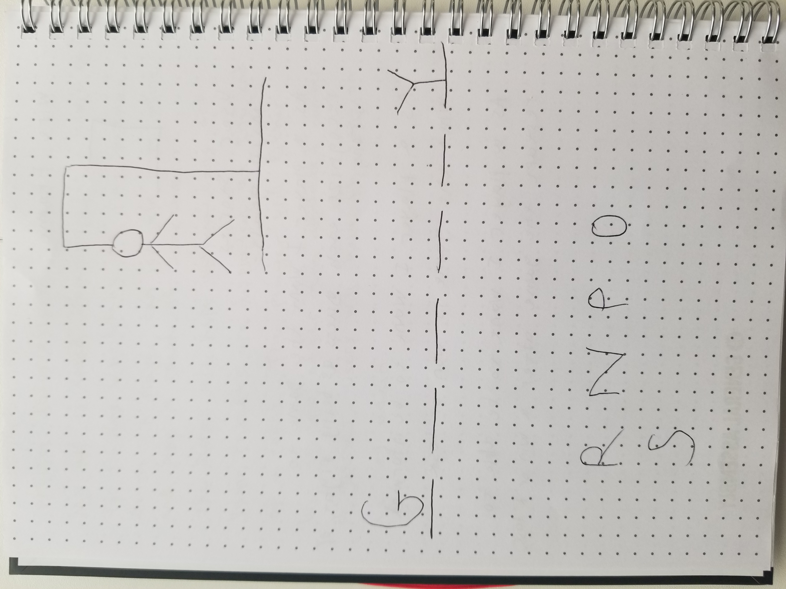

My game project.

START GAME
  - Initialize the game (choose word, set guesses)
  - WHILE incorrect guesses < max attempts
      - Display current state of the word
      - Get player's letter guess
      - IF letter is correct AND not guessed before
          - Reveal letter(s) in word
          - Add letter to guessed letters
      - ELSE
          - Increment incorrect guess count
      - IF all letters in word are guessed
          - Display victory message
          - END GAME
  - IF incorrect guesses == max attempts
      - Display game over message
      - END GAME
END GAME




```javascript
// 1) Define all varibales that track game state
//      letter guessed
//      max attempts
//      incorrect guesses
// 
// 2) Track all contstants
//      hangman
//      alphabet
```

| Day       | Task                        | Blockers | Notes |
|-----------|-----------------------------|----------|-------|
| Monday    | Create and present proposal |          |       |
| Tuesday   | Create html, js, css files  |          |       |
| Wednesday | Create basic scaffolding    |          |       |
| Thursday  | Add functionality           |          |       |
| Friday    | Add styling                 |          |       |
| Saturday  | Finaliza MVP                |          |       |
| Sunday    | Work on stretch goals       |          |       |
| Monday    | Presentation Day!           |          |       |