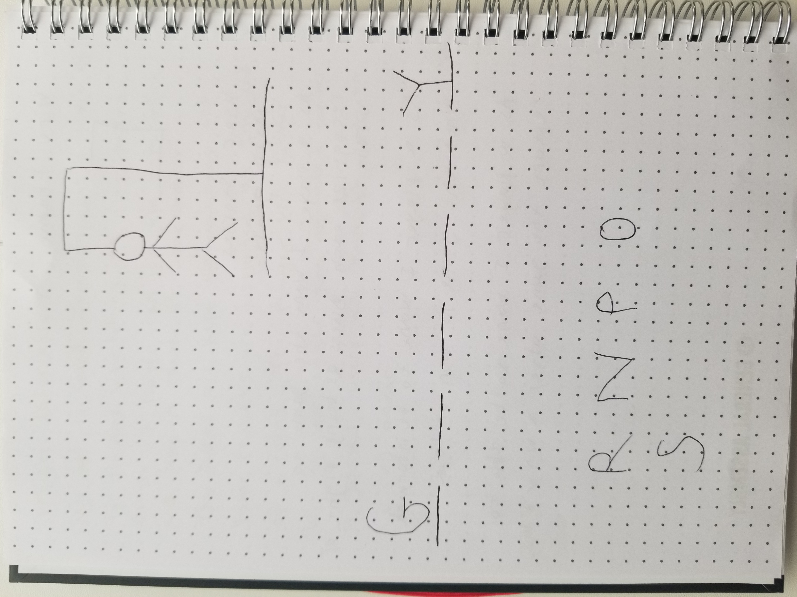

# Hangman

## Project Description 
My app is called Hangman. It is a game app for players who want to play Hangman online. A player can join the game online and play a round of Hangman.
The scores are kept automatically and game results are displayed at the end of each round.
The player will either win or loose after the alocated number of guesses.
Users will have the option to play again.

## Pseudocode

```javascript
// 1) Define any variables used to track the state of the game:
//  A randomly generated word.
//  The given word.
//  Correct guesses. 
//  Incorrect guesses.
//  Parts of the Hangman.
//  Win or lose massege.
//  We'll need a reference to a DOM element to display messages.
//  current letter 
//  limit of the number of guesses


// 2) Define the required constants:
//  An array of randomly generated words.

// 3) Handle a player clicking a button.
//  once clicked capture the letter

// 4) LOOP Compare the player choice to the computer choice, and check for a match.
//   compare current letter to the randomly generated word
//   As long as there are guesses remaining, continue the game.

// 5) Render a win/lose message to the player. 
//    Clearly indicate who won.


```
## Wire Frames


## User Stories

#### MVP Goals

- As a player I want to see a landing page when the game starts.

- As a player I want the game to recognize each guess as being right or wrong.

- As a player I want to be informed when the game is won or lost.

- As a player I want to be able to restart the game after a win or a loss.

#### Stretch Goals

- As a player, I would like a victory animation when I win the game, so that I feel good about my victory!
- As a player, I would like to hear an audible sound when I mark a game box so that I know my selection worked.
- As a player, I would like to play this game online so that I don't have to have my challenger sitting next to me.
- As a player who wants to dominate the battlefield I want to become the ultimate Hangman tactician so I can beat all of my opponents

#### Notionboard Template
Notionboard template for building projects ( You can use this for any project )
https://www.notion.so/GA-Unit-3-Tunr-Lab-da2c82fafd4e4a7aa654676732db9ee3

#### Timeline - Daily Accountability
Example of a Timeline to keep organized and on task for hitting goals every single day you’re on the sprint for your project.

Create your own table using this markdown table generator website:
https://www.tablesgenerator.com/markdown_tables

Do not neglect to plan, you will thank yourself later for being proactive!
| Day       | Task                        | Blockers | Notes |
|-----------|-----------------------------|----------|-------|
| Monday    | Create and present proposal |          |       |
| Tuesday   |  Game functionality, mostly js logic, basic grid  and flexbox  |          |       |
| Wednesday |Styling and connecting the UI to game    |          |       |
| Thursday  | Finalizing MVP fxing bugs, deployment           |          |       |
| Friday    |Stretch goals and fixing bugs                 |          |       |
| Saturday  | Stretch goals                |          |       |
| Sunday    | Finishing touches       |          |       |
| Monday    | Presentation Day!           |          |       |               |          |                 |


Tuesday game functionality, mostly js logic, basic grid and flexbox

Wed styling and connecting the UI to game functionality

Thu finalizing MVP fixing bugs, deployment

Fri Stretch goals and fixing bugs

Sat Stretch goals

Sun Finishing touches
